# DeepSeek-R1: 強化学習によるLLMの推論能力向上

<div align="center">
  
</div>

## 概要
大規模言語モデル(LLM)の推論能力を強化するため、純粋な強化学習(RL)アプローチを用いたDeepSeek-R1シリーズを開発。教師データなしでRLを適用したDeepSeek-R1-Zeroと、少量のコールドスタートデータを組み合わせたDeepSeek-R1を提案。主要な数学/コーディングベンチマークでOpenAI-o1シリーズと同等の性能を達成。

<p align="center">
  
</p>

## 主要特徴

### モデルアーキテクチャ
- **DeepSeek-R1-Zero**: 教師データなしの純粋RL訓練
- **DeepSeek-R1**: コールドスタートデータ+マルチステージ訓練
- **蒸留モデル**: Qwen/Llamaベースの1.5B～70Bモデル

### 主な貢献
1. **RLによる推論能力の自己進化**: SFTなしでCoT生成/自己検証能力を獲得
2. **マルチステージ訓練パイプライン**:
   - コールドスタートSFT → 推論特化RL → 汎用能力SFT → 総合RL
3. **効率的な知識蒸留**: 大規模MoEモデルの推論パターンを小規模密モデルに転移

## 評価結果

### 主要ベンチマーク比較
| ベンチマーク          | DeepSeek-R1 | OpenAI-o1-1217 | GPT-4o |
|-----------------------|-------------|----------------|--------|
| AIME 2024 (Pass@1)    | 79.8%       | 79.2%          | 9.3%   |
| MATH-500 (Pass@1)     | 97.3%       | 96.4%          | 74.6%  |
| Codeforces (レーティング) | 2029        | 2061           | 759    |
| MMLU (Pass@1)         | 90.8%       | 91.8%          | 87.2%  |

### 蒸留モデル性能
| モデル                        | AIME 2024 | MATH-500 | パラメータ数 |
|-------------------------------|-----------|----------|------------|
| Distill-Qwen-32B              | 72.6%     | 94.3%    | 32B        |
| Distill-Llama-70B             | 70.0%     | 94.5%    | 70B        |
| QwQ-32B-Preview (ベースライン) | 50.0%     | 90.6%    | 32B        |

## 技術的アプローチ

### 訓練パイプライン

```mermaid
graph TD
    A[ベースモデル] --> B[コールドスタートSFT]
    B --> C[推論特化RL]
    C --> D[Rejection Sampling]
    D --> E[汎用能力SFT]
    E --> F[総合RL]
```


### 強化学習アルゴリズム
Group Relative Policy Optimization (GRPO) を採用：
```python
class GRPO:
    def __init__(self, policy_model, ref_model):
        self.policy = policy_model
        self.ref = ref_model

    def compute_loss(self, samples):
        # KLダイバージェンス正則化を適用
        advantages = compute_advantages(samples)
        ratios = policy_prob / ref_prob
        return -torch.min(ratios * advantages, clip(ratios, 1-ε, 1+ε) * advantages)
```

## 使用方法

### 推奨設定
```python
from transformers import AutoModelForCausalLM

model = AutoModelForCausalLM.from_pretrained(
    "deepseek-ai/DeepSeek-R1",
    trust_remote_code=True,
    torch_dtype="auto"
)

# 推論例
prompt = "二次方程式 x² - 5x + 6 = 0 の解を求めよ。ステップバイステップで考え、最終回答を\\boxed{}内に記述してください。"
output = model.generate(prompt, temperature=0.6, top_p=0.95, max_length=1024)
```

### 重要パラメータ
- 温度: 0.5-0.7 (推奨0.6)
- 最大生成長: 32,768トークン
- システムプロンプト非使用

## 制限事項と将来展望
- **現行課題**:
  - 多言語混在問題
  - プロンプト設計への敏感性
  - ソフトウェア工学分野での性能向上余地
  
- **将来の方向性**:
  - マルチモーダル推論能力の統合
  - 推論効率の最適化
  - 安全なRLアライメント手法の開発

## ライセンス
- モデルウェイト: [Model License](LICENSE-MODEL)
- コード: [MIT License](LICENSE)

## 引用
```bibtex
@article{deepseek2024r1,
  title={DeepSeek-R1: Incentivizing Reasoning Capability in LLMs via Reinforcement Learning},
  author={DeepSeek-AI et al.},
  journal={arXiv preprint arXiv:2501.12948},
  year={2024}
}
```

<div align="center">
  <a href="https://chat.deepseek.com/">
    
  </a>
  <a href="https://huggingface.co/deepseek-ai">
    
  </a>
</div>
